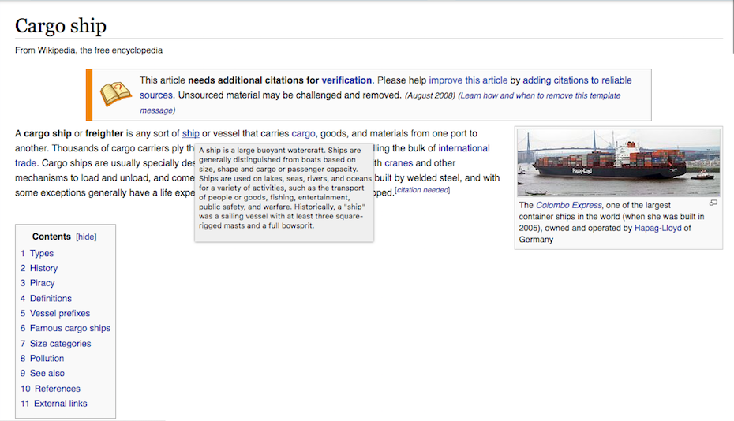

# wiki-preview
A Chrome extension in JavaScript to preview a Wikipedia article in a tooltip by hovering over the link.

In order to install this Chrome extension, simply fork this repository onto your computer. Type chrome://extensions into your address bar in Google Chrome, then drag the folder into the screen and drop it.

